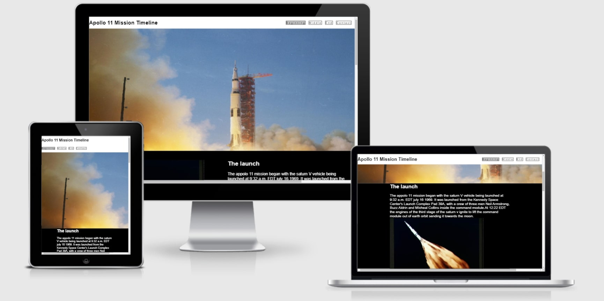
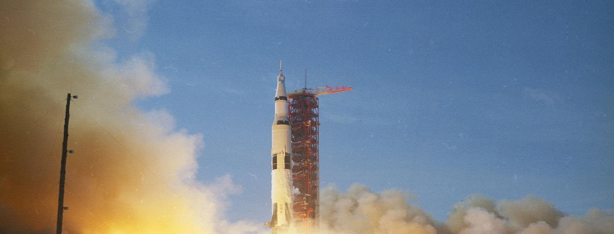
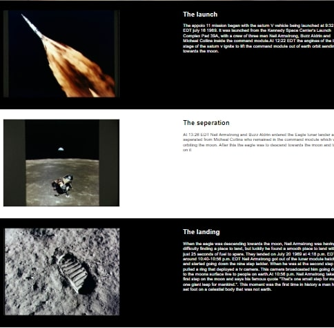
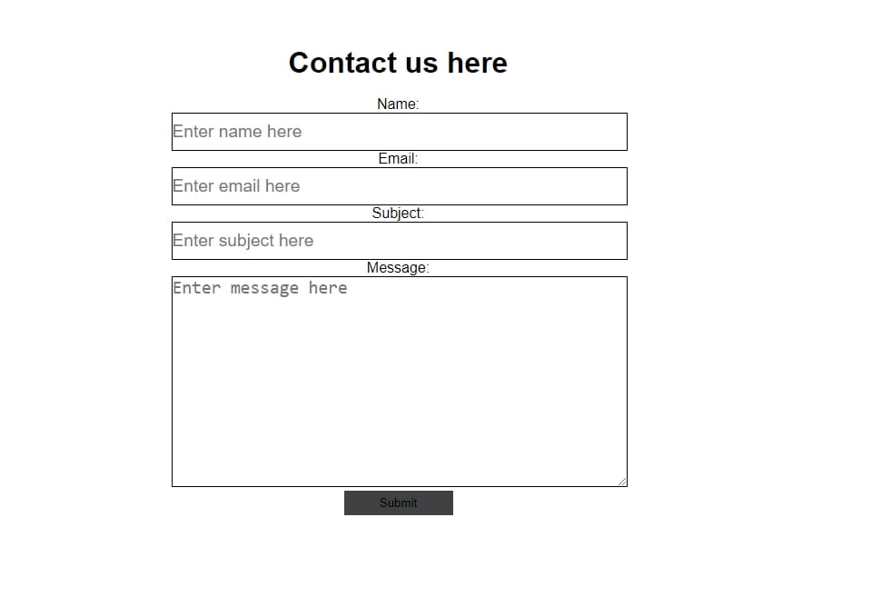

# Apollo 11 Mission Timeline

This website was created to provide a user who is interested in the apollo 11 mission with information about it that is presented in cronological order and has images and videos relating to the events.

## Features
 
### Existing features

- __Navigation Bar__
    - Is on every page of the website, has links to all the pages, some elements change color to show which page youre on and when you're hovering over them
    - This bar is part of the header which is fixed to the top of the screen for easy accessability

- __Hero image__
    - Each page apart from the contact page has a hero image this image Is always related to what information is going to be presented on that page. For example the page about the beginning  has a hero image of a rocket launching.
    - It provides users with images showing them what was happing at the time.

- __Main information section__
    - On the three pages where information about the event is presented it is presented in 3 sections that alternate between having a black background and white text and a white backgroung with black text
    - This makes the information very clear to see, it is also accompanied by a relevant image of what was happening at that time 

- __Footer__
    - The footer contains the youtube twitter and instagram icons, these icons are links to nasa's youtube twitter and instagram
    - They change color when you hover over them and the pages are opened in a new tab when clicked

- __Contact page__
    - The contact page is where someone could potentially ask questions about something they would like to know
    - It has a form that the user can fill out

